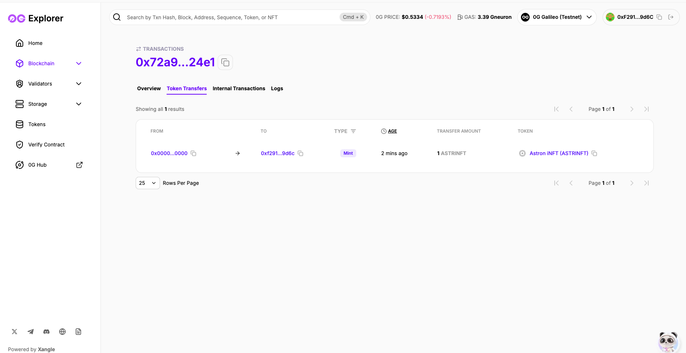
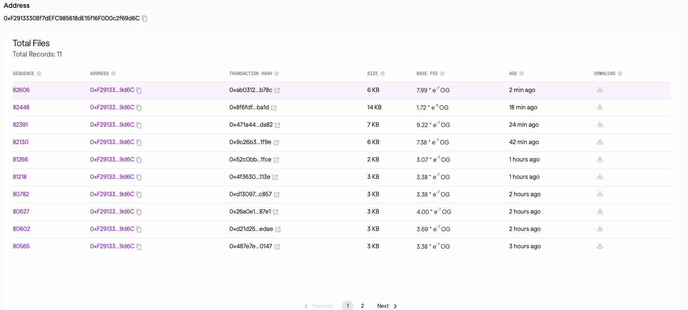

# 🌌 Astron: The Agent Hub

**Replicate any Twitter (X) persona into an interactive, self-learning Intelligent NFT.**

Astron is a revolutionary platform that bridges social identity and decentralized AI. By leveraging the Coinbase x402 protocol, 0G Storage, and Base L2, Astron allows users to transform any Twitter handle into a persistent, evolving AI agent encapsulated within an iNFT.

---

## 📸 Blockchain Verification on 0G galileo 

<div align="center">
  
  
</div>

---

## ✨ Key Features

- 🧠 **Persona Synthesis**: Advanced scraping of target tweets (via Apify) synthesized into a high-fidelity AI personality using GPT-4o.
- 🧊 **0G Storage**: Immutable and decentralized storage for "The Brain" (System Prompts and Memory), ensuring your agent's identity is truly yours.
- 🪂 **Gasless Airdrops**: Zero-friction onboarding with iNFTs airdropped directly to user wallets on Base, with all gas subsidized by the platform.
- 🔄 **Hermes Reflection Loop**: A self-learning architecture where agents evolve based on interactions, updating their on-chain memory pointers automatically.

---

## 🛠️ Technology Stack

- **Frontend**: [Next.js 15](https://nextjs.org/) (App Router), [GSAP](https://gsap.com/) for premium animations, [Tailwind CSS v4](https://tailwindcss.com/).
- **AI/LLM**: [OpenAI GPT-4o](https://openai.com/), [Vercel AI SDK](https://sdk.vercel.ai/).
- **Web3/Blockchain**: [Base](https://base.org/) (L2), [Ethers.js v6](https://docs.ethers.org/v6/), [Hardhat](https://hardhat.org/).
- **Storage**: [0G Storage](https://0g.ai/) (Decentralized AI Storage).
- **Data Acquisition**: [X Developer API](https://developer.twitter.com/en)

---

## 🚀 Getting Started

### Prerequisites

- Node.js (Latest LTS)
- npm or pnpm
- A wallet with USDC on Base (for generation)

### Installation

1. Clone the repository:
   ```bash
   git clone https://github.com/tayelroy/Astron.git
   cd Astron
   ```

2. Install dependencies:
   ```bash
   npm install
   ```

3. Configure environment variables:
   ```bash
   cp .env.example .env
   # Fill in your API keys (OpenAI, Apify, 0G, Base RPC, etc.)
   ```

4. Run the development server:
   ```bash
   npm run dev
   ```

Open [http://localhost:3000](http://localhost:3000) to explore the Hub.

---

## 🏗️ Architecture: The Generation Pipeline

1. **Payment**: User submits a Twitter handle; Backend issues an x402 challenge; User settles in USDC.
2. **Scrape**: Backend triggers an Apify task to fetch the latest 100 tweets from the target handle.
3. **Synthesis**: LLM analyzes tone, topics, and formatting to generate a `Persona System Prompt`.
4. **Storage**: The prompt is uploaded to **0G Storage**, returning a unique CID.
5. **Minting**: A relayer wallet calls `mintAgent` on the Base iNFT contract, binding the CID to the NFT.
6. **Interaction**: User chats with the iNFT; **Hermes Loop** runs periodically to refine the agent's memory.

---

## 📜 Smart Contracts

The project includes an Intelligent NFT (iNFT) contract on Base:
- `mintAgent(address to, string cid)`: Mints a new agent to a specific user.
- `updateBrainCID(uint256 tokenId, string newCID)`: Updates the pointer to the agent's evolving memory.

Deployment scripts are available in `/scripts`.

---

## 🛡️ License

This project is licensed under the MIT License - see the [LICENSE](LICENSE) file for details.

